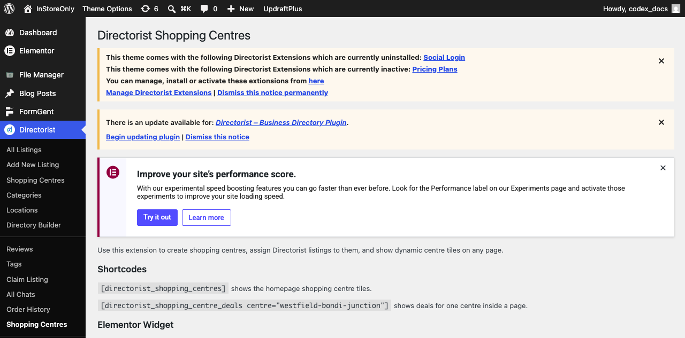
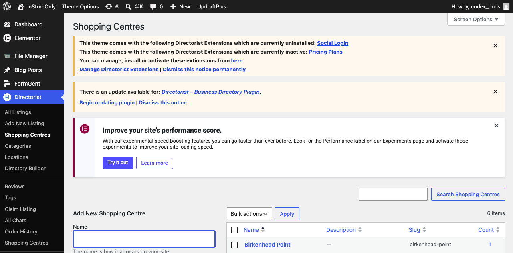
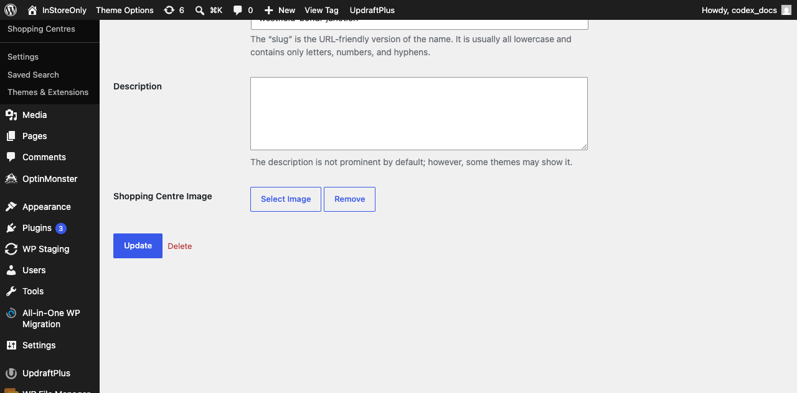
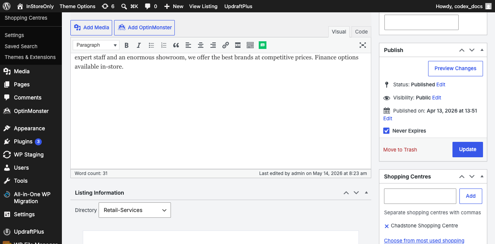
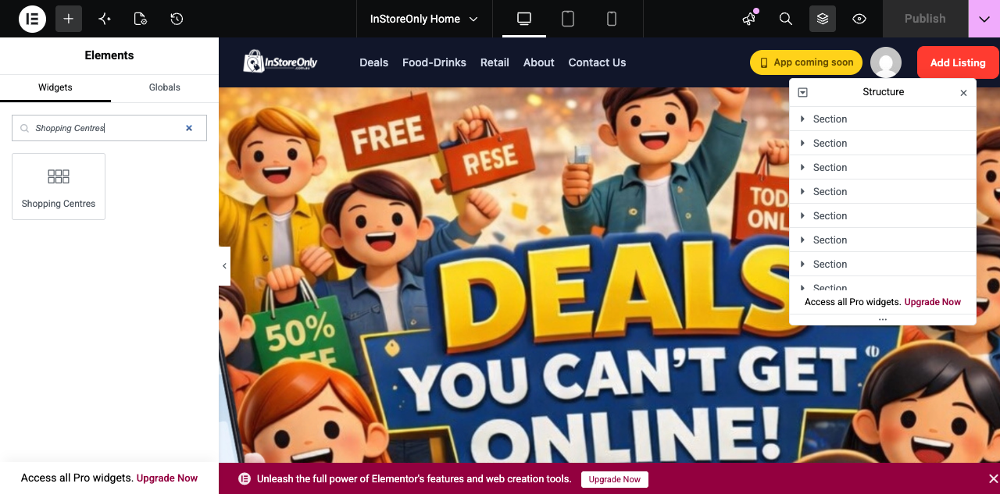
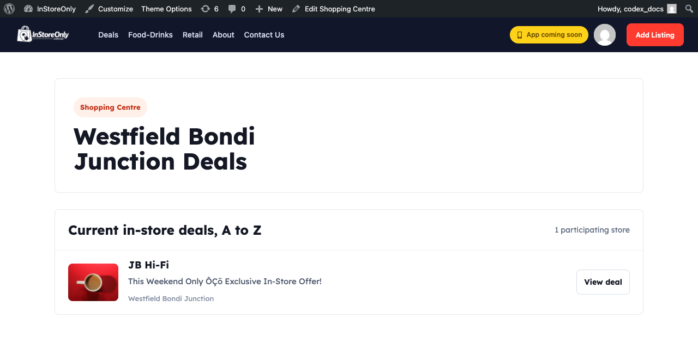

# Directorist Shopping Centres - User Guide

This guide explains how to use the **Directorist Shopping Centres** extension.

The extension lets you show shopping centres on your website, for example:

- Westfield Bondi Junction
- Broadway Sydney
- Macquarie Centre
- Chatswood Chase
- Marrickville Metro

When a visitor clicks a shopping centre, they will see the current in-store deals from retailers inside that centre.

## What You Can Do With This Extension

You can:

- Create shopping centres from the WordPress admin area.
- Upload one image for each shopping centre.
- Assign Directorist deal listings to a shopping centre.
- Show shopping centre tiles on the homepage.
- Let visitors click a shopping centre and see all deals inside that centre.
- Use the Elementor widget to design the section without editing code.

## Before You Start

Make sure these plugins are installed and active:

- Directorist
- Elementor, if you want to use the Elementor widget
- Directorist Shopping Centres

To check this, go to:

```text
Plugins > Installed Plugins
```

Find **Directorist Shopping Centres** and make sure it is active.



## Step 1: Create A Shopping Centre

Go to:

```text
Directorist > Shopping Centres
```

Then follow these steps:

1. Enter the shopping centre name.
2. Example: `Westfield Bondi Junction`.
3. Leave the slug field empty unless you want to control the URL manually.
4. Add a description if needed.
5. Click **Select Image** under **Shopping Centre Image**.
6. Upload an image or choose one from the Media Library.
7. Click **Add New Shopping Centre**.

The image you upload will be used on the homepage shopping centre tile.





## Step 2: Add Or Edit A Deal Listing

Go to:

```text
Directorist > All Listings
```

Open the deal listing you want to use.

Example deal listings:

- Zara - 30% off selected jackets
- Sushi Hub - $5 sushi trays after 4pm
- JB Hi-Fi - Bonus gift card today only
- Mecca - Free sample with purchase
- Cafe XYZ - Happy Hour coffee deal

## Step 3: Assign The Deal To A Shopping Centre

Inside the listing edit screen:

1. Look at the right side of the page.
2. Find the **Shopping Centres** box.
3. Tick the correct shopping centre.
4. Click **Update**.

After this, the deal will appear on that shopping centre page.



## Step 4: Add Shopping Centres To The Homepage With Elementor

Edit the homepage with Elementor.

Then:

1. Search for **Shopping Centres** in the Elementor widget panel.
2. Drag the **Shopping Centres** widget into the page.
3. Open the widget settings.
4. Adjust the content and style settings.
5. Click **Update**.



## Elementor Settings You Can Change

From the Elementor **Content** tab, you can change:

- Section title
- Show or hide title
- Number of columns
- Number of centres to show
- Hide empty centres

From the Elementor **Style** tab, you can change:

- Heading style
- Card background color
- Border
- Border radius
- Shadow
- Card padding
- Image height
- Image radius
- Centre name color and typography
- Deal count color and typography

This means you can style the shopping centre section using normal Elementor controls.

## Step 5: Configure The Complete Shopping Centres Archive

Go to:

```text
Listings > Shopping Centre Tools > Archive display settings
```

These settings control `/shopping-centres/` independently from the homepage Elementor widget:

- **Empty centres:** show or hide publicly visible centres that currently have no published deals.
- **Centres per page:** show 6, 12, 24, or all centres.
- **Archive search:** enable or disable search by centre name, suburb, state, or postcode.
- **Sort order:** name A–Z, current deal count, or recently added.
- **Deal count:** show or hide the current-deal count on archive cards.

The default shows empty centres, 12 per page, matching the complete staging archive. An individual centre with **Show this Shopping Centre publicly** unchecked remains hidden regardless of these archive settings.

## Step 6: Use Shortcode Instead Of Elementor

If you are not using Elementor, add this shortcode to any WordPress page:

```text
[directorist_shopping_centres hide_empty="1"]
```

You can also use:

```text
[directorist_shopping_centres title="Shop deals by shopping centre" columns="3" hide_empty="1"]
```

## Step 7: View A Shopping Centre Page

Each shopping centre gets its own page automatically.

Example:

```text
/shopping-centre/westfield-bondi-junction/
```

On that page, visitors will see all active Directorist deal listings assigned to that shopping centre.



## Visitor Flow

This is how the feature works for a website visitor:

```text
Homepage
  |
  v
Shopping Centres Section
  |
  v
Visitor clicks a centre
Example: Westfield Bondi Junction
  |
  v
Shopping Centre Deal Page
  |
  v
Visitor sees participating store deals
  |
  v
Visitor clicks a retailer deal
  |
  v
Directorist Store Deal Page
```

## Does This Use Real Data?

Yes.

This extension does not use fixed demo data.

It uses real WordPress and Directorist data:

- Shopping centre names come from the admin area.
- Shopping centre images come from the uploaded centre image.
- Deals come from Directorist listings.
- Store pages are normal Directorist listing pages.

If you create a new shopping centre, upload an image, and assign listings to it, the frontend will update dynamically.

## How To Sync Existing Listings

If older listings already have shopping centre or venue information saved, you can sync them.

Go to:

```text
Directorist > Shopping Centres
```

Click:

```text
Sync Existing Listings
```

The extension will check existing listing data and try to assign listings to matching shopping centres automatically.

## If The Shopping Centre Page Shows 404

If the shopping centre page does not open, refresh WordPress permalinks.

Go to:

```text
Settings > Permalinks
```

Then click:

```text
Save Changes
```

You do not need to change any setting. Just saving once is enough.

## Quick Checklist

Use this checklist when setting up a new shopping centre:

1. Create the shopping centre.
2. Upload the shopping centre image.
3. Create or edit Directorist deal listings.
4. Assign each listing to the correct shopping centre.
5. Add the Elementor widget or shortcode to the homepage.
6. Open the shopping centre page on the frontend.
7. Click a deal and confirm it opens the listing page.

## Common Questions

### Can one listing appear in more than one shopping centre?

Yes. If needed, you can tick more than one shopping centre on the listing edit screen.

### Do I need to edit code?

No. Normal setup can be done from WordPress admin and Elementor.

### Can I change the design?

Yes. Use the Elementor widget style controls to change the layout, colors, spacing, typography, and card design.

### What happens if a shopping centre has no deals?

The homepage and complete archive have separate controls:

- If **Hide empty centres** is enabled in the Elementor widget, the centre will not show in the homepage section until it has at least one deal.
- If **Show publicly visible centres with no current deals** is enabled in Shopping Centre Tools, the centre remains available in the complete archive and its page displays a no-current-deals message.

### Where do visitors redeem the offer?

Visitors click the deal, open the Directorist listing page, and then follow the store offer details shown there.
